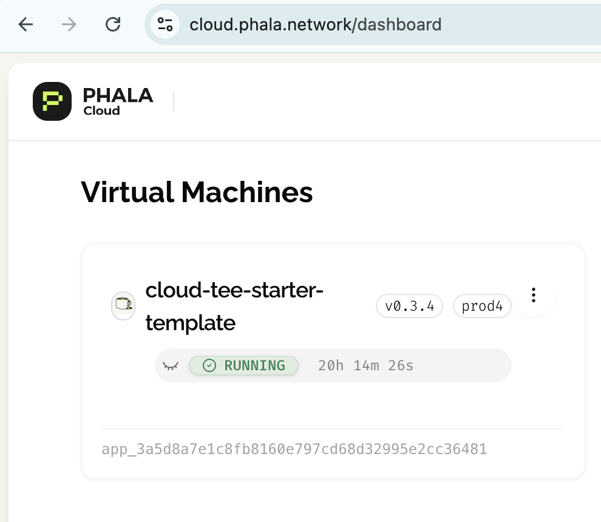

<div align="center">
  <a href="https://github.com/Phala-Network/cloud-tee-starter-template">
    <h1>Cloud TEE Starter Template</h1>
  </a>
  <a href="https://cloud.phala.network/">
    
    <br />
  </a>
  <p align="center">
    This is a starter template for building a Cloud TEE application easily with CI/CD instead of manually local build and deploy. You can fork this repository to start your own Cloud TEE application.
    <br />
    <a href="https://phalanetwork.notion.site/Phala-Cloud-User-Guide-1700317e04a18018a98ed9ea39b02670"><strong>Explore Phala Cloud User Guide »</strong></a>
    <br />
    <br />
    <a href="https://github.com/Phala-Network/cloud-tee-starter-template/issues">Report Bug</a>
    ·
    <a href="https://t.me/+nbhjx1ADG9EyYmI9">Telegram</a>
    ·
    <a href="https://discord.gg/phala-network">Discord</a>
  </p>
</div>

## 📋 Prerequisites

- Fork the GitHub repository `cloud-tee-starter-template`
- Phala Cloud account ([Sign up with Redeem Code](https://cloud.phala.network/register?invite=WELCOME10))
- Docker Hub/Registry account, to push the built docker image to the registry

## 🔧 Step 1: Configure Repository Secrets

1. Go to your repo **Settings → Secrets and variables → Actions**
2. Add these required secrets:

| Secret Name | Description | How to Get |
|-------------|-------------|------------|
| `DOCKER_REGISTRY_USERNAME` | Your container registry username | From your Docker Hub/Registry account |
| `DOCKER_REGISTRY_PASSWORD` | Registry password/access token | [Generate access token](https://docs.docker.com/docker-hub/access-tokens/) |
| `PHALA_CLOUD_API_KEY` | Phala Cloud authentication key | From [Phala Cloud Dashboard](https://cloud.phala.network/dashboard/tokens) → "Create Token" |
| `APP_NAME` | Deployment name (e.g., `my-tee-app`) | Choose name without special characters except `-` |
| `DOCKER_IMAGE` | Full image path (e.g., `docker.io/username/image-name`) | Follow registry naming conventions |

The above secrets are required for the deployment workflow to work. And you can add more secrets to the repository as needed. These secrets will be used in the deployment workflow to build the docker image and deploy to Phala TEE Cloud. Once the secrets are added, you can trigger the deployment workflow anytime.

## 🚀 Step 2: Deployment Workflow

The GitHub Action will automatically:

1. Build Docker image from Dockerfile, `api-server/Dockerfile` in this example.
2. Push built docker image to your container registry
3. Update the docker compose file with the new image
4. Deploy to Phala TEE Cloud using `teecloud` CLI with the name you set in `APP_NAME` with the updated docker compose file.

### Trigger Conditions:
```yaml
on:
  push:
    branches: [main]
    paths:  # Only trigger when these files change, you can add more files to the list
      - "api-server/pyproject.toml"
      - "api-server/Dockerfile"
  workflow_dispatch:  # Manual trigger available
```

If you want to deploy to Phala TEE Cloud manually, you can trigger the workflow manually from the GitHub Actions page.

## ✅ Step 3: Verify The Deployment
After successful workflow run once the workflow is triggered and the deployment is successful, you can verify the deployment on [Phala Cloud Dashboard](https://cloud.phala.network/dashboard).

<div align="center">
  
</div>

And then you can see the deployment details on the dashboard and visit the endpoint to test the application.

## 🛠️ Troubleshooting

Common issues:

1. **Authentication Errors**: Verify all secrets are correctly set
2. **Docker Build Failures**: Check `api-server/Dockerfile` syntax
3. **Debug Github Actions Locally**: You can debug the Github Actions locally by running `act` command. The `act` can be installed from https://github.com/nektos/act. The secerts you need to set are the same as the ones in the repository secrets to local `.env` file in the root of the repository.

## 🔗 Additional Resources

- [Phala Cloud Official Docs (Draft)](https://phalanetwork.notion.site/Phala-Cloud-User-Guide-1700317e04a18018a98ed9ea39b02670)
- [TEE Cloud CLI GitHub](https://github.com/Phala-Network/tee-cloud-cli)
